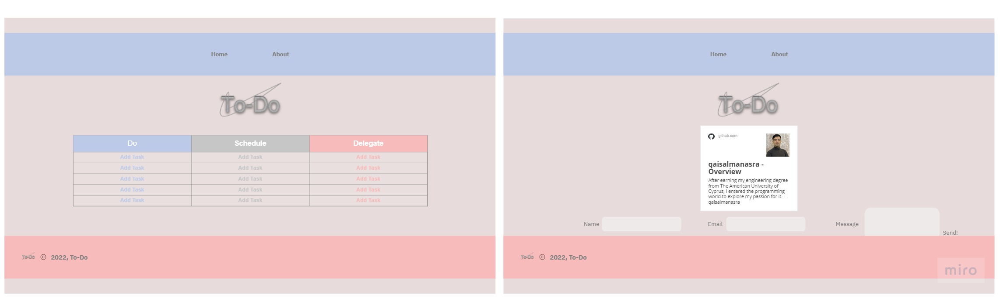

# todo-project

I have used multiple types to build this project such as texts, tables, images, iframe for my description and form for static pull.

I have used the three types of styling.

I have linked favicon after generating favicon.ico using link rel="shortcut icon" href="images/favicon.ico" type="image/x-icon" but it didn't apear.

it takes me 1 day to complete this assignment as predicted.

